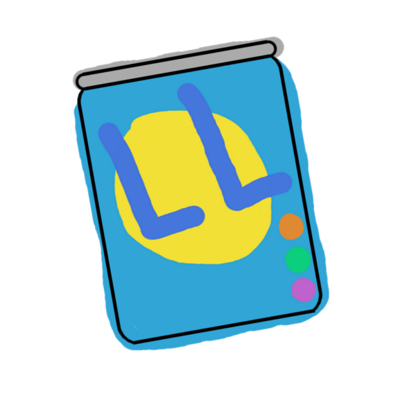

# Lugo Lite theme

This is my personal theme, a version of light theme that doesn't cause eye strain. It's implemented here as an Atom package.

I did a YouTube video on making this theme [here](https://www.youtube.com/watch?v=oWjyAE--2EI)

## Publishing
You can learn how to publish your own syntax theme (or any other atom package) [here](https://flight-manual.atom.io/hacking-atom/sections/publishing/).

## Authors
- **Alex Lugo** (it's just me here)
  - Subscribe to my [YouTube](https://www.youtube.com/alexlugo) channel
